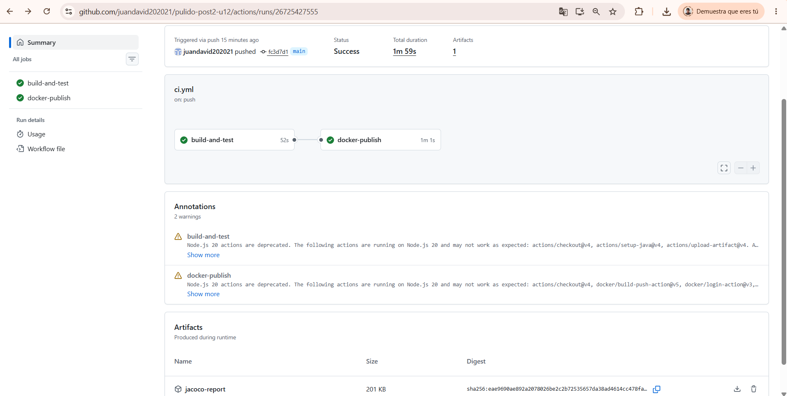
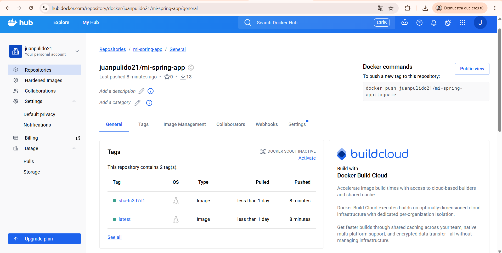

# Catálogo de Productos — Post-Contenido 2, Unidad 12


Pipeline de integración y entrega continua con **GitHub Actions** que automatiza compilación, pruebas con cobertura **JaCoCo**, construcción de imagen Docker con **multi-stage build** y publicación en **Docker Hub**.

---

## Imagen Docker

```bash
docker pull juanpulido21/mi-spring-app:latest
```

---

## Prerrequisitos

- Java 21
- Maven 3.9.x
- Docker Desktop
- Cuenta en Docker Hub
- Cuenta en GitHub con Actions habilitado

---

## Clonar el repositorio

```bash
git clone https://github.com/juandavid202021/pulido-post2-u12.git
cd pulido-post2-u12/catalogo
```

---

## Pipeline CI/CD

El pipeline se activa automáticamente en cada push a `main` y realiza:

1. Compilación del proyecto con Maven
2. Ejecución de pruebas unitarias
3. Generación de reporte de cobertura JaCoCo (disponible como artefacto descargable)
4. Construcción de imagen Docker con multi-stage build
5. Publicación de la imagen en Docker Hub con tags `latest` y `sha-<commit>`

---

## GitHub Secrets requeridos

Para que el pipeline funcione correctamente se deben configurar estos secrets en **Settings → Secrets and variables → Actions**:

| Secret | Descripción |
|--------|-------------|
| `DOCKERHUB_USERNAME` | Usuario de Docker Hub (ej: `juanpulido21`) |
| `DOCKERHUB_TOKEN` | Access Token generado en Docker Hub → Account Settings → Personal access tokens |

---

## Jobs del pipeline

### Job 1 — build-and-test
- Configura JDK 21 con caché Maven para acelerar builds
- Ejecuta `mvn clean verify` que compila, corre pruebas y genera reporte JaCoCo
- Publica el reporte de cobertura como artefacto descargable por 7 días

### Job 2 — docker-publish
- Solo se ejecuta en push a `main` (no en pull requests)
- Depende de que `build-and-test` termine exitosamente (`needs: build-and-test`)
- Se autentica en Docker Hub usando los Secrets configurados
- Construye la imagen con el Dockerfile multi-stage del proyecto
- Publica la imagen con tags `latest` y `sha-<commit>`

---

## Usar la imagen publicada localmente

```bash
# Descargar la imagen
docker pull juanpulido21/mi-spring-app:latest

# Ejecutar en modo desarrollo (H2 en memoria)
docker run -p 8080:8080 \
  -e SPRING_PROFILES_ACTIVE=dev \
  juanpulido21/mi-spring-app:latest
```

---

## Evidencias de los Checkpoints

### Checkpoint 1 — GitHub Secrets configurados
Los secrets `DOCKERHUB_USERNAME` y `DOCKERHUB_TOKEN` están creados en Settings → Secrets and variables → Actions del repositorio. Los nombres coinciden exactamente con los usados en el workflow YAML.

### Checkpoint 2 — Pipeline ejecutándose con éxito
La pestaña Actions muestra ambos jobs (`build-and-test` y `docker-publish`) con check verde ✅. El reporte JaCoCo queda disponible como artefacto descargable en cada ejecución.



### Checkpoint 3 — Imagen publicada en Docker Hub
La imagen `juanpulido21/mi-spring-app` está publicada en Docker Hub con los tags `latest` y `sha-<commit>` visibles en la página del repositorio.

